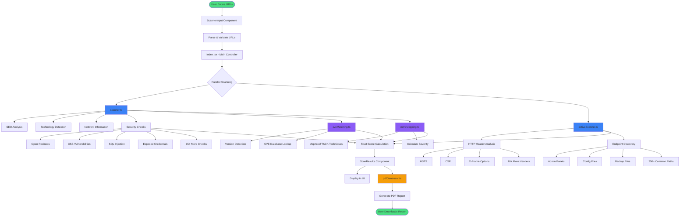

# ReconLite - Application Workflow

## System Architecture & Data Flow

## Workflow Stages

### 1. Input Stage
- User enters one or multiple URLs via `ScannerInput` component
- URLs are parsed and validated
- Main controller (`Index.tsx`) initiates scanning process

### 2. Parallel Analysis Stage
Two main scanners run simultaneously:

#### A. Core Scanner (`scanner.ts`)
- **SEO Analysis**: Meta tags, titles, descriptions
- **Technology Detection**: Frameworks, CMS, servers, CDN
- **Network Information**: DNS, IP, geolocation
- **Security Checks**: 15+ vulnerability patterns (XSS, SQLi, open redirects, etc.)

#### B. Active Scanner (`activeScanner.ts`)
- **HTTP Header Analysis**: Checks 10 critical security headers
- **Endpoint Discovery**: Probes 250+ common paths for exposed resources

### 3. Intelligence Mapping Stage
- **CVE Matching** (`cveMatching.ts`): Detects technology versions and matches against vulnerability database
- **MITRE Mapping** (`mitreMapping.ts`): Maps findings to ATT&CK techniques and calculates severity

### 4. Scoring Stage
- Aggregates all findings
- Calculates trust score (starts at 100, deducts based on severity)
- Categorizes risk level

### 5. Output Stage
- **Display**: Results shown in UI via `ScanResults` component
- **Export**: PDF report generated on-demand with detailed findings

## Key Features

- ✅ **Client-Side Only**: No backend required, runs entirely in browser
- ✅ **Parallel Processing**: Scans multiple aspects simultaneously for speed
- ✅ **CORS Handling**: Automatic fallback to proxy when needed
- ✅ **Real-Time Progress**: Live updates during scanning
- ✅ **Comprehensive Reports**: PDF export with executive summary and compliance mapping

## Technology Stack

- **Frontend**: React, TypeScript, Tailwind CSS
- **Scanning**: Custom pattern matching and HTTP analysis
- **Intelligence**: Static CVE and MITRE ATT&CK databases
- **Reports**: jsPDF with auto-pagination

---

*Last updated: 2025-11-25*
